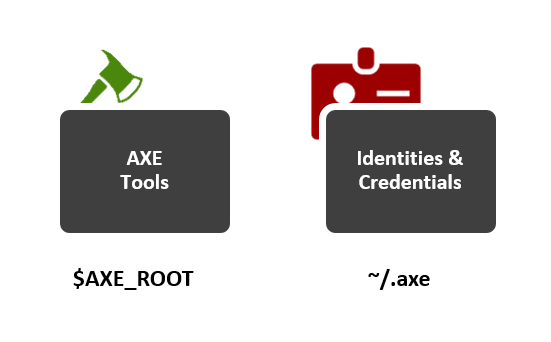
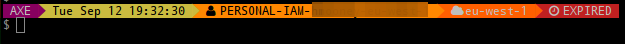

# AXE - The Cloud Hatchet

## Introduction

 - The goal of the AXE tools is to help with the day-to-day and management of your virtual infrastructure and to help you reach a point where other automation tools can then take over in a repeatable, versionable manner.
 - The tools are aimed at being **complimentary** to the existing suite that you're likely already using; AWS CLI, Terraform, Chef, Puppet, Ansible, Salt, etc

## Components

The AXE toolset is seperated into distinct components;

1. The AXE tools themselves (eg. axe-instance-list)
2. Identity and Credential management that manipulates the active identity to facilitate multiple sets of credentials across many separate stacks (eg. aws.conf)

## How it fits together

 - AXE: load an identity from one of the configured IDs in `~/.axe` which manipulates the default `AWS_....` environment variables that many of the AWS tools support
     + `$AWS_CONFIG_FILE`
     + `$AWS_DEFAULT_REGION`
     + `$AWS_ACCESS_KEY_ID`
     + `$AWS_SECRET_ACCESS_KEY`

 - AXE: use some of the commands provided to interact with your virtual infrastructure
 - Use any other tools that support loading credentials from the shell envionment; [Terraform], [saws], [terraforming], etc
 - The CLI helper will also show the active AWS profile as well as the remaining time on the STS token if using MFA or Federated Access

[Terraform]: http://terraform.io/
[saws]: https://github.com/donnemartin/saws
[terraforming]: https://github.com/dtan4/terraforming

